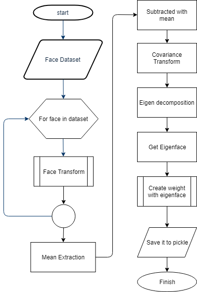
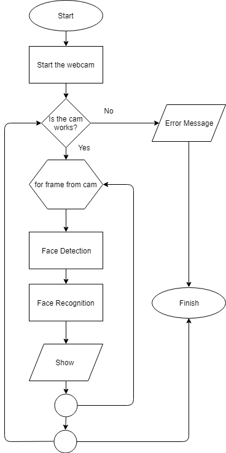

# FERNLV Documentation

## Requirements
To run this project, you need to install:
1. OpenCV:  `pip install opencv-python`
2. Numpy: `pip install numpy`
3. Tensorflow: please refers to [link](https://www.tensorflow.org/install/)
4. PyQt5: `pip install PyQt5`

(:grey_exclamation: Cautions: I haven't check the compatibility of all version from the library. I used `numpy==1.15.4`, `PyQt5==5.11.3`, `tensorflow==1.11.0`, and `opencv==3.4.1`. Please use python>3.4)

---
### Before Usage
****Please download all of haarcascade*.xml from this [link](https://github.com/opencv/opencv/tree/master/data/haarcascades) to provide the module. Put all of them on the `Assets` folder****

All of the pickle file on the project is based on my example. It detect and recognize several character from MCU (_11 character: Tony Stark (not in ironman suit), Loki, Thanos, Bucky Barnes, Wanda Maximoff, Thor, Steve Rogers (not in Captain America suit), Natasha Romanoff, Dr Strange, T'Challa (not in black panther suit), Mantis_). If the face detected but the face is not in the list, it will give `unknown` label.

After you installed all the requirement and download the XML file of haarcascade, you can use the project as well as on the example folder.

---
## Workflow

 As a part of this documentation, I would write the workflow I've made so far and illustrate it.
 
 ### EigenFace
 #### A.Training Phase
 

steps:
1. _Face Dateset_: it consist of folder with this configuration. For every sub folder, please use the name of the class:

        -> Root_folder
            -> class_1
            -> class_2
            -> class_3
2. _Face Transform_ : change image to a vector. Later the vector will combine into one matrix, as dataset matrix
3. _Mean Extraction_: Extract mean from the matrix
4. _Subtracted with Mean_ : to create covariance matrix, the dataset matrix will be subtracted with its mean
5. _Covariance Transform_: dot product the subtracted matrix with its transpose
6. _Eigen Decomposition_: get eigenvector and eigenvalue from covariance matrix
7. _Get Eigenface_: Take _k_-value from the eigenvalue as eigenface
8. _Create Weight with Eigenface_: It is done by dot prodcut the eigenface with the subtracted matrix
 9. _Save it to Pickle_: Later we save the weight, eigenface and the mean
 
 ##### _Code_
 1. Split the data using `split_data_train_test_val`. More on [link](https://github.com/otakbeku/FERNLV/blob/c905c1d3fca76c7394338aa2e0bcd9d0ec943a77/FERNLV/EigenUtils.py#L144)
 
        split_data_train_test_val(image_dir: str, base_dir: str = 'base_dir',
                              testing_percentage=0,
                              validation_percentage=10,
                              size=32, save=True,
                              cropped=False)
        
       - image_dir: a root folder consist of category-named directories. The root directory should looks like this:
       
        -> root_dir:
             --> class_1
             --> class_2
             --> ...
             
    - **base_dir**: the directory to placed the train, validation and testing.
    - **testing_percentage**: From the available data, it will used n-percent for testing. USE INTEGER
    - **validation_percentage**:From the available data, it will used n-percent for validation. USE INTEGER
    - **size**: The size to resize the image. Suggested 32, so the image will resize into (32, 32)
    - **save**: Save option. If True, it will produce pickle files for train, validation and testing (if available)
    - **cropped**: if the dataset already in desired condition, put this into False. Otherwise it will cropped faces
    from the image using default face cascade classifier. Use it with cautions
    - **return**: train_data, train_labels, val_data, val_labels, test_data, test_labels
    
    Example:
 
        train_data, train_labels, val_data, val_labels, test_data, test_label = eu.split_data_train_test_val('Dataset', base_dir='base_dir')
 
 2. Training. Use `create_eigen_face_vector`. More on [link](https://github.com/otakbeku/FERNLV/blob/c905c1d3fca76c7394338aa2e0bcd9d0ec943a77/FERNLV/EigenUtils.py#L296)
 
        create_eigen_face_vector(data, normalization=True, max_component=25, save=True)
    - **data**: data that consists of image vector in each row
    - **normalization**: the option for normalization
    - **max_component**: number of component to be used for eigenface
    - **save**: the option for saving the eigenface
    - **return**: eigen_face, weight, average
    
    Example:

        eigen_face, weight, average = eu.create_eigen_face_vector(train_data)
 
 #### B. Usage Workflow (based on [this example](https://github.com/otakbeku/FERNLV/blob/master/Example/MainWindow.py))
 
 
 
 Steps:
 1. _Start the Webcam_: start with available channel. Default is 0. You can choose yours by defined the number on the blank box
 2. Check if the webcam is works or not. If not, the process would not be execute. Otherwise the the looping wil start while yielding the frame
 3. _Face Detection_: Using haarcascade face classifier from OpenCV and crop it.
 4. _Face Recognition_: From the cropped face, the face recognition would try to recognize whose the face belongs to.
 5. _Show_: show the frame with detected and recognized face
 
 ##### _Code_
From the example, I used `from FERNLV.FaceRecognition import EigenFaceRecognition`

        __init__(self, eigenface_path=None, train_path=None, val_path=None, face_cascade='default')

The code above used to make `EigenFaceRecognition` instance.

- **eigenface_path**: path of eigenface pickle
 - **train_path**: path of train data pickle
 - **val_path**: path of validation data pickle
 - **face_cascade**: face_cascade: name of haarcascade that available from OpenCV which is:
 
    - 'default': default frontal face
    - 'alt': alternative of frontal face
    - 'alt2': another alternative for frontal face
    - 'altree': another alternative version with tree
    - 'profile': Only detect the profile face
    - 'LBP': XMl made with Local Binary Pattern
    - 'cudaDef': A Cuda version of default 
 
To predict the face from the given image, use `predicts` method.

        predicts(self, image)
        
- **image**: an image. it should be `Numpy.ndarray`
- **return**: an image and the list of the cropped face

Example

        import cv2
        from FERNLV.FaceRecognition import EigenFaceRecognition as eu
        
        image = cv2.imread(...)
        efr = eu(eigenface_path='eigenface.pickle', train_path='train_data.pickle', val_path='val_data.pickle', face_cascade='default')
        detected_face, crops = efr.predicts(image)
 
 ---
## References
 The explanation about eigenface can be reach from:
 - Paper
    - M. Turk; A. Pentland (1991). ["Face recognition using eigenfaces"](http://www.cs.ucsb.edu/~mturk/Papers/mturk-CVPR91.pdf). Proc. IEEE Conference on Computer Vision and Pattern Recognition. pp. 586–591.
    - M. Turk; A. Pentland (1991). ["Eigenfaces for recognition"](http://www.cs.ucsb.edu/~mturk/Papers/jcn.pdf). Journal of Cognitive Neuroscience. 3 (1): 71–86. doi:[10.1162/jocn.1991.3.1.71.](https://doi.org/10.1162%2Fjocn.1991.3.1.71) PMID [23964806](https://www.ncbi.nlm.nih.gov/pubmed/23964806)
    
 - External Links 
     - [Wikipedia](https://en.wikipedia.org/wiki/Eigenface)
  
